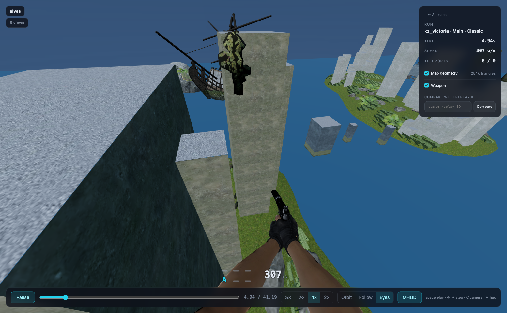
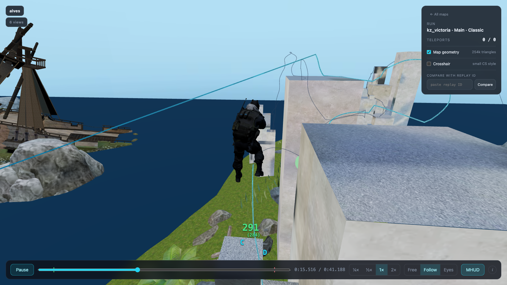
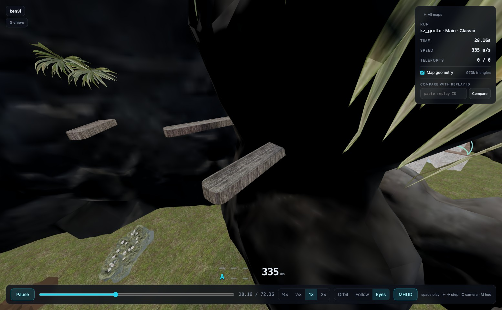

# kz-replay

Watch CS2KZ runs in the browser. Playback needs no game install, video rendering,
or upload to YouTube. The replay file goes in, WebGL comes out. Optional map and
player-model conversion fetches selected Workshop and Counter-Strike 2 assets.

**Live at [demo.kzcomp.com](https://demo.kzcomp.com)** — the map list, a
scrollable [world record feed](https://demo.kzcomp.com/wr), and a player that
opens any retained replay by id and can race two runs against each other.





It reads the CS2KZ `.replay` format directly, rebuilds the run tick by tick, and
plays it back in three.js — through the runner's eyes, from a follow camera, or
free flight — inside the real map geometry with the map's own baked lighting and
real sky.

Map geometry is powered by [Source 2 Viewer](https://s2v.app)
([ValveResourceFormat](https://github.com/ValveResourceFormat/ValveResourceFormat)).
Every converted map in this project was exported with it. The Source 2 file formats
are not documented by Valve — everything here relies on years of reverse
engineering by that project's contributors, and none of it was worked out here.

## Try it

The development setup requires [Node.js 24 LTS](https://nodejs.org/) and npm.

```bash
npm install
node bin/kzreplay.js wrs --limit 6      # download the current world records
node bin/kzreplay.js map kz_victoria    # convert that map's geometry + lighting (optional)
npm run dev                             # http://localhost:5180
```

Keys: `space` play/pause, `←` `→` skip five seconds (hold shift for a
0.125-second fine step), `C` camera.

`/` is the map list, `/wr` is the world record feed, `/watch?ids=<id>` is one run —
see [docs/api.md](docs/api.md) for how to link to a replay or compare two by id.

## Commands

| Command                                              | What it does                                                                       |
| ---------------------------------------------------- | ---------------------------------------------------------------------------------- |
| `node bin/kzreplay.js wrs --limit 6`                 | Fetch classic-mode world records that still have replays and build their tracks    |
| `node bin/kzreplay.js wrfeed`                        | Rebuild the list the world record feed scrolls (4 calls)                           |
| `node bin/kzreplay.js fetch <record_id>`             | Fetch one record by id (also accepts a local file path)                            |
| `node bin/kzreplay.js inspect <record_id>`           | Dump the header, the section table and the timer events                            |
| `node bin/kzreplay.js verify --limit 60`             | Parse many retained replays and report format or alignment failures                |
| `node bin/kzreplay.js map kz_victoria`               | Download and convert one map to a web glb, with textures, baked light and real sky |
| `node bin/kzreplay.js map kz_victoria --no-textures` | The same without the mapper's surface textures                                     |
| `node bin/kzreplay.js refresh [--no-geometry]`       | Rebuild the map and record catalog the viewer browses                              |
| `node bin/kzreplay.js player-model`                  | Borrow the CT character out of CS2 for the third-person camera                     |
| `node bin/kzreplay.js compare <a> <b>`               | Full stats for two runs, and where the time was lost                               |
| `npm run check`                                      | Section and alignment sanity check across four known run pairs                     |

Tracks are written to `viewer/public/tracks/`, which the dev server reads directly.
Downloaded `.replay` files are cached in `samples/` so re-runs need no network.
The shorter `kzreplay` form is available after `npm link`; it is not placed on
your `PATH` by `npm install` inside this checkout.

`wrs` defaults to `--mode classic` and omits records whose replay is no longer
stored. CS2KZ does not retain every submitted replay indefinitely.



_kz_grotto by ReDMooN — [Steam Workshop](https://steamcommunity.com/sharedfiles/filedetails/?id=3121168339)._

## Documentation

- [docs/api.md](docs/api.md) — linking to a replay, comparing two by id, the HTTP endpoints
- [docs/replay-format.md](docs/replay-format.md) — how a `.replay` file is read, and where the data comes from
- [docs/maps.md](docs/maps.md) — the map pipeline: geometry, textures, baked lighting, the real sky
- [docs/comparison.md](docs/comparison.md) — how two runs are compared, in the viewer and on the CLI
- [docs/viewer.md](docs/viewer.md) — browsing, the world record feed, view counts
- [docs/self-hosting.md](docs/self-hosting.md) — build and run a public instance
- [THIRD_PARTY_NOTICES.md](THIRD_PARTY_NOTICES.md) — upstream code, game assets, maps and trademarks

## Layout

```
src/          parser, analysis, Node pipelines, and browser-compatible shared modules
bin/          the CLI
viewer/       Vite dev app
viewer/src/player.js   framework-free entry point for the three.js player
server/       the production server: static viewer, replay proxy, views, nightly refresh
```

`viewer/src/player.js` is framework-free on purpose: it takes a canvas and a
decoded track. It is not a standalone drop-in file: it imports Three.js, shared
modules from `src/`, and adjacent modules in `viewer/src/`. Reuse it through this
project's module graph (or package that graph with your own bundler), then call
`createPlayer()` and `dispose()`.

## License

This project is AGPL-3.0-only — see [LICENSE](LICENSE). Its tick decoder is a
JavaScript port of the AGPL-3.0-licensed
[cs2kz-metamod source at an immutable revision](https://github.com/KZGlobalTeam/cs2kz-metamod/tree/7bf63fd18f588bd69e91c9236eb44392be57ec11/src/kz/replays);
the original C++ file is not vendored here. Maps, screenshots, Valve game assets,
names, and trademarks may have separate owners and terms. See
[THIRD_PARTY_NOTICES.md](THIRD_PARTY_NOTICES.md) before redistributing generated
assets or a pre-populated deployment.
