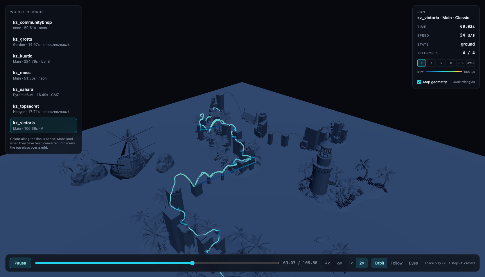
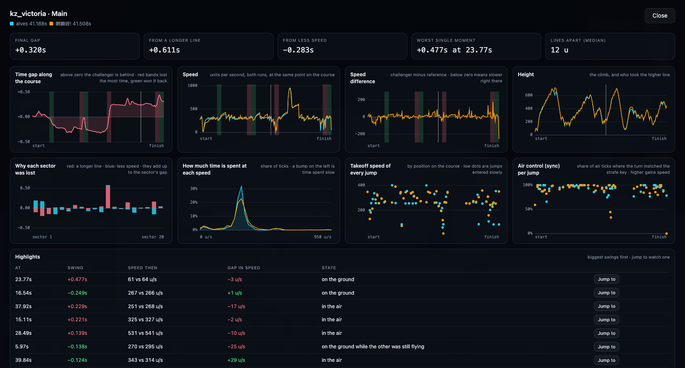

# kz-replay

Watch CS2KZ runs in the browser. No game installed anywhere, no video rendering,
no upload to YouTube. The replay file goes in, WebGL comes out.

Stage 1 (done): the run as a path in empty space, with a live HUD.
Stage 2 (working): real map geometry around the run.
Stage 3: ghost racing, embedded in the kz-tournament site.



## Try it

```bash
npm install
node bin/kzreplay.js wrs --limit 6      # download the current world records
node bin/kzreplay.js map kz_victoria    # convert that map's geometry (optional)
npm run dev                             # http://localhost:5180
```

Keys: `space` play/pause, `←` `→` step (hold shift for a second at a time), `C` camera.

**Or convert a map without leaving the page.** When a run's map has not been
converted, the viewer shows a **Convert this map** button. Pressing it asks the dev
server to do the whole job — workshop download, geometry export, compression — and
then loads the result. It takes a minute or two, mostly the download. The endpoint
only exists on the dev server, because the conversion needs local tools; there is no
way for a browser to do it alone.

The map step needs two tools that are not npm packages:

- `steamcmd` (`brew install steamcmd`) — downloads the workshop map. No Steam account and no CS2 install: anonymous login is enough.
- `tools/Source2Viewer-CLI` — download `cli-macos-arm64.zip` (or your platform) from the [ValveResourceFormat releases](https://github.com/ValveResourceFormat/ValveResourceFormat/releases) and unzip it into `tools/`.

Runs whose map has not been converted still work; they play in empty space with a grid.

### Why the map files are small

The raw exports are enormous — kz_victoria 27 MB, kz_grotto 175 MB, kz_moss **251 MB**
— and almost none of it is the level. Two passes in `src/trimMap.js` take care of that
before anything is compressed, and neither moves a single vertex:

- **Attributes nobody reads.** The exporter writes POSITION, NORMAL, TANGENT,
  TEXCOORD_0, TEXCOORD_1, COLOR_0 and more for every vertex. The viewer draws
  untextured flat-shaded geometry, so it reads POSITION and nothing else: seven
  streams get dropped, roughly 70 bytes per vertex down to 12.
- **Foliage.** The ten biggest meshes in kz_moss are poplar branches, dogwood
  branches and cypress trees. Leaves are millions of triangles a KZ player runs
  straight through, and they hide the level behind them.

| map         | raw export | shipped | triangles dropped |
| ----------- | ---------- | ------- | ----------------- |
| kz_victoria | 27 MB      | 0.8 MB  | 31%               |
| kz_grotto   | 175 MB     | 2.6 MB  | 46%               |
| kz_moss     | 251 MB     | 0.4 MB  | 94%               |

Mesh simplification is still in the pipeline as a fallback for anything still over
~15 MB after trimming, but no map has needed it since.

**Foliage is matched between separators, never as a substring.** A plain
`name.includes("fern")` matched every `inferno_stone_floor` mesh in kz_grotto, deleted
the floors the run stands on, and left the run with nothing underneath it —
`probeGround()` went from finding a floor under 25 of 29 standing ticks to 0 of 29.
Meshes under 150 triangles are also never dropped, so a structural mesh survives even
if its name matches by accident. "grass" is deliberately not in the word list: a grass
blend is as likely to be the ground as a tuft.

After trimming, `probeGround()` puts the floor a median of **0.42 units** below the
player's feet on kz_victoria and **0.39** on kz_grotto. kz_moss sits at 2.3, which is
the map's own terrain, not something the trimming did.

In the overview camera the map is drawn semi-transparent. Caves and indoor maps would
otherwise bury the camera in solid rock; the inside cameras keep it opaque.

## Commands

| Command                        | What it does                                            |
| ------------------------------ | ------------------------------------------------------- |
| `kzreplay wrs --limit 6`       | Fetch the current world records and build their tracks  |
| `kzreplay fetch <record_id>`   | Fetch one record by id (also accepts a local file path) |
| `kzreplay inspect <record_id>` | Dump the header, the section table and the timer events |
| `kzreplay verify --limit 60`   | Parse many replays and report any that desync           |
| `kzreplay map kz_victoria`     | Download and convert one map's geometry to a web glb    |
| `kzreplay compare <a> <b>`     | Full stats for two runs, and where the time was lost    |
| `npm run check`                | Alignment sanity check across four known run pairs      |

Tracks are written to `viewer/public/tracks/`, which the dev server reads directly.
Downloaded `.replay` files are cached in `samples/` so re-runs need no network.

## Browsing and watching runs

The home screen lists the current CS2KZ maps with their Steam Workshop images.
Filter by name or geometry availability, open a map, then choose a course and mode.
The viewer offers the world record when its replay exists and otherwise falls back
to the fastest available replay on that leaderboard.

This works because nothing in `src/` uses a Node API: the same parser, track builder
and analysis run in either place. The one exception is the download itself —
`replays.cs2kz.org` sends no CORS headers, so the dev server proxies `/replay/<id>`
to it (see `viewer/vite.config.js`). A deployed viewer needs the same one line of
proxying somewhere server side. The API itself does send CORS headers and is called
directly.

## Comparing two runs in the viewer



Open a map and paste another replay id into **Compare with replay ID**. Compatible
runs load immediately; mismatched maps, courses, or modes are rejected with a clear
message instead of producing a misleading comparison.

**Analysis** opens one focused, clickable time-gap chart plus side-by-side run
statistics. Shaded bands keep the important gains and losses visible, and clicking
anywhere on the graph seeks both replays to that point on the course.

**The most useful number in there** is the split between _a longer line_ and _less
speed_. Time is distance over speed, so a gap can only come from covering more
ground or moving slower. Splitting it exactly:

```
Δt = (challengerDistance − referenceDistance) / referenceSpeed      ← the line
   + challengerDistance · (1/challengerSpeed − 1/referenceSpeed)    ← the speed
```

turns "you lost 0.58s here" into "0.12s of that was a wider line, 0.46s was less
speed", which is the difference between a routing mistake and a movement mistake.

- Both runs play on one clock, so one visibly pulls ahead. Cyan is the run you
  selected, amber is the rival.
- **Gap now** is the time difference _at this point on the course_, not at this
  moment in time. **Apart** is how far apart the two players are in world units.
- The chart along the bottom is the gap over the whole course. Above the centre
  line the rival is behind, below it they are ahead. Where the line slopes upwards,
  the rival is losing time right there. The playhead marks where the run is now.
- The alignment runs in the browser from the two track files, so any pair works
  with no extra build step. It takes a few hundred milliseconds.

The chart's y axis is scaled to the 98th percentile of the gap, not the maximum:
where the two lines cross, the projection can throw one spiky sample, and scaling
to that would flatten everything worth looking at.

## Comparing two runs on the command line

```bash
node bin/kzreplay.js compare <faster_id> <slower_id> [--sectors 20] [--json out.json]
```

The point of the comparison is that **the two runs are never compared at the same
moment in time, only at the same point on the course.** "0.3s behind at the finish"
says nothing about where those 0.3s went, and the two runs take different lines, so
distance travelled is not comparable either: a wider line is longer, not further
along.

So one run is the reference, and every tick of the other is projected onto the
reference's path to answer "how far along the course was this?". That gives both
runs a shared axis, and the time difference along it is the racing delta everyone
already understands from F1 or Trackmania.

The report covers the sector-by-sector delta with a chart, the biggest gains and
losses, speed, route length and efficiency, air and ground time, every jump with
takeoff speed, airtime, distance, strafe count and sync, perfect bhop rate, aim
movement, key hold times, how far apart the two lines are, and a jump by jump table
matched by position on the course.

`--json` writes the whole thing, including the delta curve, for charting later.

## How a replay is read

```
u32               headerSize
byte[headerSize]  protobuf ReplayHeader     -> src/header.js
section           TickData                  -> src/ticks.js   (delta encoded, zstd)
section           SubtickData               (skipped: not needed at 64 Hz)
section           Weapons, Jumps            (skipped)
section           Events                    -> src/events.js  (timer start/end, teleports)
section           CmdData, CmdSubtickData    (skipped)
```

Each section is `u32 compressedSize, u32 uncompressedSize, u32 elementCount` and
one zstd frame.

Tick data is delta encoded: every tick starts with a `u64` change-flag mask, then
carries only the fields that changed. Unchanged fields inherit from the previous
tick, `pre` from the previous tick's `post`, and `post` from this tick's `pre`.

**A replay usually holds more than one attempt.** The player starts, resets, starts
again, and only the last attempt is the run that was submitted. So the run is the
stretch from the last timer start _before_ the finish. Measuring from the first start
silently swallows the failed attempts: on one kz_grotto run that made the duration
16.5s instead of 14.97s and quietly corrupted every statistic derived from it, and it
made two runs on kz_topsecret look like they were on different routes entirely.

**The decoder must land exactly on the last byte of the section.** It throws if it
does not, because a single wrong field size shifts everything after it and the
output would still look plausible. That check is the test suite. `kzreplay verify`
runs it across many real replays.

Source of truth for the format is the plugin itself:
`cs2kz-metamod/src/kz/replays/{kz_replay.h,data.cpp,compression.cpp}` and
`protobuf/kz_replay.proto`. `compression.cpp` is vendored here for reference.
Format version 5 is current; the parser refuses anything newer instead of guessing.

## Where the data comes from

- Records: `https://api.cs2kz.org/records` — the `replay_available` field says whether a replay exists.
- Replay files: `https://replays.cs2kz.org/<record_id>` — public, no auth. This URL is not in the OpenAPI spec; it comes from the plugin source.

**Retention matters.** The API deletes replays older than about 24 hours unless the
record is a world record, a top 10 on a ranked course, or on a tier 8 course. World
records are safe forever. Anything else has to be archived the day it is set.

## Layout

```
src/          parser + track builder + API client (Node, and the browser for track.js)
bin/          the CLI
viewer/       Vite dev app
viewer/src/player.js   the three.js player — the only file that ports to the website
samples/      cached .replay downloads
```

`viewer/src/player.js` is framework-free on purpose: it takes a canvas and a
decoded track. Moving it into `kz-tournament` later is a React `useEffect` that
calls `createPlayer()` and `dispose()`, plus a Tailwind pass on the HUD.
