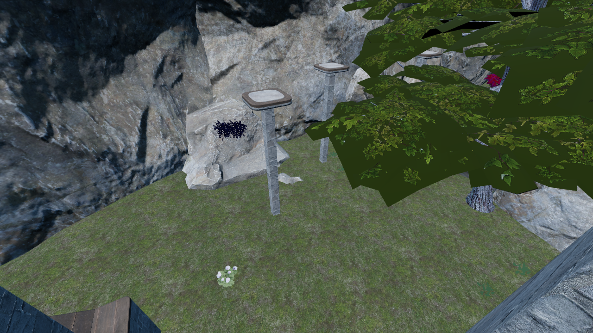
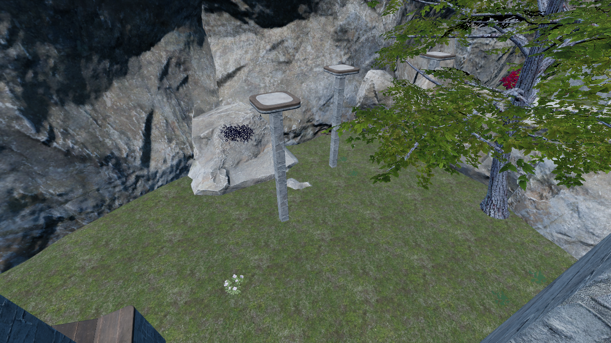

# Grotto opacity regression

These are **two viewer captures**, not a CS2 fidelity comparison. They isolate a
verified source-data loss in the material export path.

The CS2 texture for `tree_large` contains alpha from 0 to 255, but VRF 19.2's glTF
export without compiled shader metadata produced an RGB-only PNG. The material
still said `MASK`, with its authored cutoff. Preserving that glTF material alone
therefore left opaque leaf cards. Direct source extraction restores alpha without
changing exported RGB, material cutoff, or double-sidedness. The same repair reaches
37 Grotto materials. Animated candle textures and one environment-shader opacity
case remain unresolved.

Before:

After:

Both images: 1280×720, DPR1, Chrome/SwiftShader, replay
`019ea309-1656-7e02-b6c9-9c6b00294481`, first person at 12 s, overlays disabled,
exposure 1.15. Camera position/quaternion, FOV, aspect and drawing-buffer size were
programmatically checked equal. Map: [kz_grotto](https://steamcommunity.com/sharedfiles/filedetails/?id=3121168339),
Workshop VPK SHA-256 `b1e14165856d7740acab667935e0dae494755533513ca01c144629ae56a7dccc`.
Underlying map/game content remains its authors' property.

The changed foliage ROI (left 710, top 0, width 570, height 385) has MAE 30.345/255.
An unchanged rock ROI (left 0, top 0, width 400, height 300) has MAE 0.000444/255,
maximum difference 1/255. These numbers locate the change; a large difference here
is expected, **not** a fidelity score. Raw captures, metadata and absolute-difference
output are under local `artifacts/grotto-alpha-*`.

Conversion revisions: before `9c24dfca07f99269312e9e40`; after
`232dee11f02ebeeca9b82041`. The second is an explicitly recorded diagnostic repack
of the first with restored opacity and final meshopt compression. It is not yet a
full run of the newer compiled-shader-metadata pipeline. The GLB shrinks from
374.91 MB to 347.14 MB with unchanged texture dimensions and retained geometry;
the total bundle remains too large for acceptance. Repeated timings and real CS2
matched views are separate gates.

## Software performance diagnostic

Same Chrome/SwiftShader, 1280×720 DPR1, overlays off, fixed first-person poses from
8–10 s, 120 measured frames per repetition after an identical warm-up. All three
paired replay-time arrays match exactly. This tests the isolated opacity/packing
change, not the complete branch against main, and is **not hardware-GPU acceptance**.
Other lightweight investigation work ran on the shared host; rerun on idle target
hardware for acceptance.

| Repetition | Before median / p95 / p99 (ms) | After median / p95 / p99 (ms) |
| --- | --- | --- |
| 1 | 602.05 / 1120.17 / 1216.34 | 598.15 / 1037.86 / 1196.13 |
| 2 | 589.20 / 1038.18 / 1169.36 | 594.95 / 1107.20 / 1186.88 |
| 3 | 592.85 / 1029.50 / 1176.92 | 591.85 / 1091.42 / 1170.83 |

There is no convincing change beyond this run-to-run variation. Median draw calls
are 180 on both sides; that alone would not establish performance parity. Cold
readiness is 24.36 / 23.07 / 22.63 s before and 23.89 / 23.57 / 23.14 s after.
Raw frame/call/triangle samples, browser/hardware identity, memory counts, compilation
timings and configuration are preserved in [before](performance-opacity-before.json)
and [after](performance-opacity-after.json). The original viewer's nominal real-time
benchmarks are not comparable because they traversed different pose sequences.
